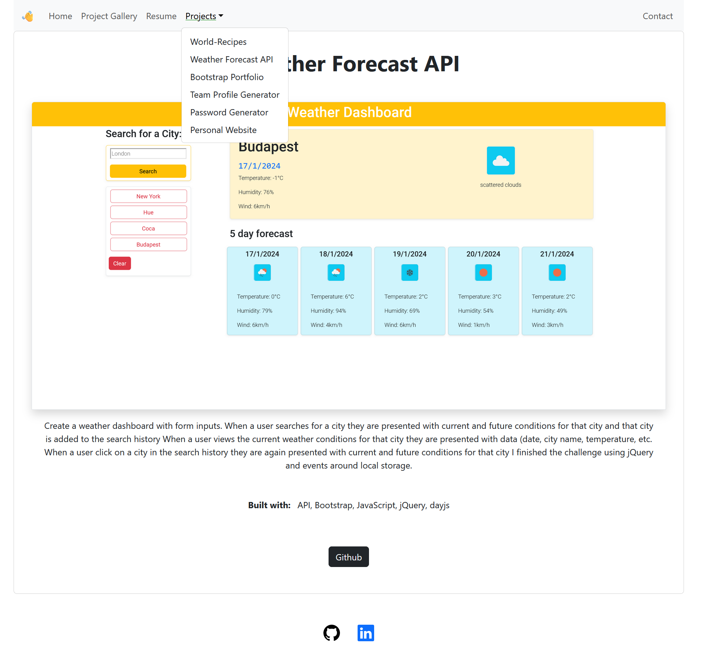

# React + Vite

## Module 13 Portfolio site built with REACT

## Table of Content
* [Overview](#Overview)
* [Screenshots](#Screenshots)
* [Links](#Links)
* [My_process](#My_process)
* [Built_with](#Built_with)
* [What_I_learned](#What_I_learned)
* [Author](#Author)
* [Credits](#Credits)

## Overview

Portfolio website using React to show my works/projects were created during my bootcamp.

## Screenshots

[contact form](./src/assets/images/screenshots/contactform-errormsg.png)

### Links
[https://github.com/hszilvi/my-react-portfolio]
[live link](https://genuine-cobbler-62f841.netlify.app/)

### My_process
* created a wireframe using excalidraw 
* created the basic react components and connected the elements
* add styling but tried to keep the built in bootstrap styles

### Built_with

### What_I_Learned
I learned a lot how to create the tree structure of React, how to destructure the element of the app.

## Author
Szilvia Horvath
GitHub[https://github.com/hszilvi]
LinkedIn[https://www.linkedin.com/in/horvathszilvi/]

### Credits
waving emoji: https://jarv.is/notes/css-waving-hand-emoji/
icons: https://icons8.com/icon/set/react/color
react pdf: https://github.com/nnarhinen/react-pdf

